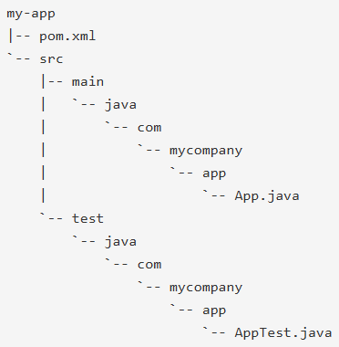
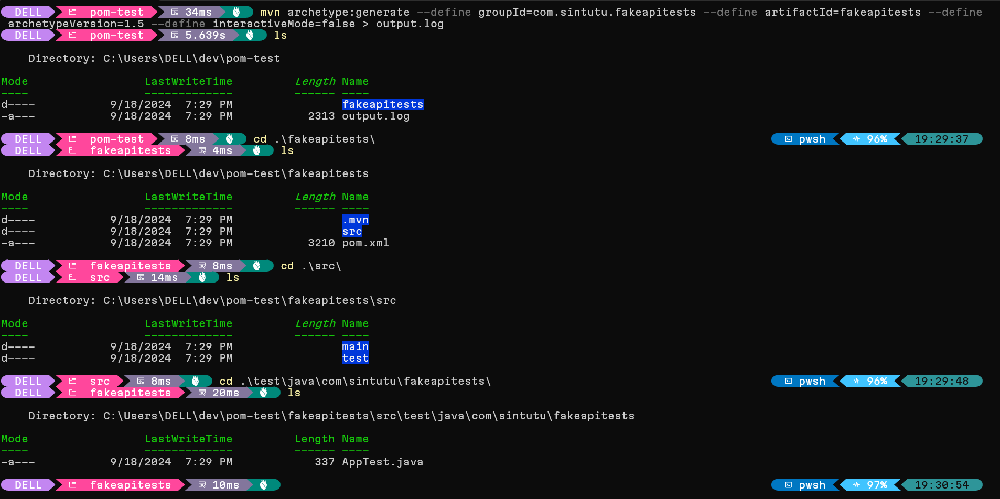
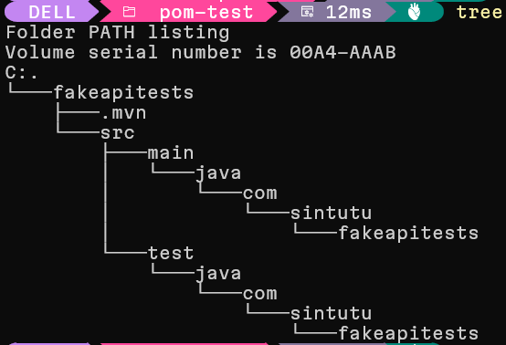
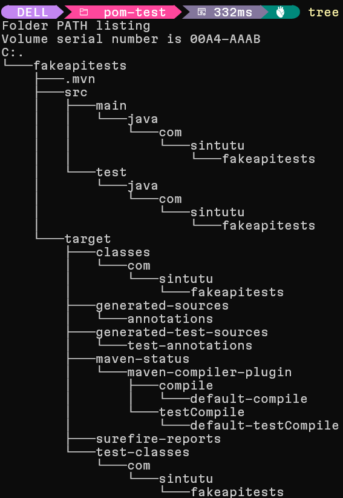

[# Is there a `mvn` template for junit 5 and selenium?

I want to use the `mvn` cli to generate a template that contains at least junit. I ant to learn how to add selenium as a project dependency. At this point I don't know how to use `mvn`. I'm doing things the hard way without IntelliJ so I can see what's happening under the hood.

A great place to start reading the doc is the [Maven Users Centre
](https://maven.apache.org/users/index.html). It's a gentle intro that contains child pages:
* [Maven in 5 Minutes](https://maven.apache.org/guides/getting-started/maven-in-five-minutes.html)
* [Maven Getting Started Guide](https://maven.apache.org/guides/getting-started/index.html)

In getting-started, I learned `mvn` needs `java` from [Maven in 5 Minutes](https://maven.apache.org/guides/getting-started/maven-in-five-minutes.html)! A lot of the learnings in this document are from reading these sources.

## `mvn` cli intro

To get help, I can type

```bash
mvn --help
```

At the top of the help menu, I get the usage guidance.

> `mvn --help`
>
> `usage: mvn [options] [<goal(s)>] [<phase(s)>]`

I can find the whole list of options on the [Maven CLI Options Reference
](https://maven.apache.org/ref/3.9.9/maven-embedder/cli.html (Maven CLI Options Reference
)).

## Creating a project

```pwsh
mvn archetype:generate -DgroupId=com.mycompany.app -DartifactId=my-app -DarchetypeArtifactId=maven-archetype-quickstart -DarchetypeVersion=1.5 -DinteractiveMode=false
```

This command from Maven in 5 minutes runs the `archetype:generate` goal with the options passed in for `groupId`, `artifatId`, `archetypeArtifactId`, `archetypeVersion` and `interactiveMode` set. The options are set with the `-D` prefix.

*Sadly, the help menu said I pass in `[options]` before `[goal]` but in use it's the other way around. Documentation isn't always perfect.*

The docs go on to [explain what this does](https://maven.apache.org/guides/getting-started/maven-in-five-minutes.html#what-did-i-just-do):

> You executed the Maven goal archetype:generate, and passed in various parameters to that goal. The prefix archetype is the plugin that provides the goal. If you are familiar with Ant, you may conceive of this as similar to a task. This archetype:generate goal created a simple project based upon a maven-archetype-quickstart archetype. Suffice it to say for now that a plugin is a collection of goals with a general common purpose. For example the jboss-maven-plugin, whose purpose is "deal with various jboss items".

Here's how I understand it.

1. The goal is `generate`.
2. The definition of `generate` is specific to the plugin `archetype`. 
    1. The Archetype Plugin allows the user to create a Maven project from an existing template called an archetype.
    2. The plugin `archetype` plugin has documentation [here](https://maven.apache.org/archetype/maven-archetype-plugin/).
    3. I want to use the generate goal which is defined [here](https://maven.apache.org/archetype/maven-archetype-plugin/generate-mojo.html)
    4. `archetype` is part of [Maven Core](https://maven.apache.org/ref/3.9.9/maven-core/index.html#maven-core)'s tools and thus is included by default.
3. I used the [maven-archetype-quickstart](https://maven.apache.org/archetypes/maven-archetype-quickstart/) archetype by passing it in via `-DarchetypeArtifactId`
    1. I specify the version of `maven-archetype-quickstart` that I want with `archetypeVersion`. It seems [1.5](https://mvnrepository.com/artifact/org.apache.maven.archetypes/maven-archetype-quickstart/1.5) is the latest available one of this archetype, as per https://mvnrepository.com/artifact/org.apache.maven.archetypes/maven-archetype-quickstart.
4. `groupId` is something mandatory to all [POMs](https://maven.apache.org/guides/getting-started/index.html#how-do-i-make-my-first-maven-project).
    1. This element indicates the unique identifier of the organization or group that created the project. The groupId is one of the key identifiers of a project and is typically based on the fully qualified domain name of your organization. For example org.apache.maven.plugins is the designated groupId for all Maven plugins. For my project I want it to be `com.sintutu.fakeapitests`. Why so specific? This whole project's purpose is to house *tests* on the fake api.
    2. The full specification for a POM is available [here](https://maven.apache.org/ref/3.9.9/maven-model/maven.html#maven).
5. `artifactId` is another manatory field mandatory to all [POMs](https://maven.apache.org/guides/getting-started/index.html#how-do-i-make-my-first-maven-project). 
    1. This element indicates the unique base name of the primary artifact being generated by this project. The primary artifact for a project is typically a JAR file. Secondary artifacts like source bundles also use the artifactId as part of their final name. A typical artifact produced by Maven would have the form <artifactId>-<version>.<extension> (for example, myapp-1.0.jar). I'm choosing to name mine `fakeapitests` because the primary artifact I want to publish *is* tests.
6. `interactiveMode` is set to false. It's a concept associated with a settings.xml file.
    1. This line is in this example just to ensure that I don't use any settings that may be defined somewhere and I'm not aware of it for this example.
    2. There are [two locations](https://maven.apache.org/settings.html#quick-overview)here a settings.xml file may live: the Maven install: `${maven.home}/conf/settings.xml` or a user's install: `${user.home}/.m2/settings.xml`. I've just checked `${maven.home}/conf/settings.xml` and it's commented out.
7. `-D` needs to be prefixed to each of the options I'm setting. It's weird. This turns out to not work in practice. Instead it's better to just use `--define` instead, and use it as a separate word rather than a prefix.

### What should I be getting out of running the command?

I should get something similar to



and a pom.xml similar to 

```xml
<project xmlns="http://maven.apache.org/POM/4.0.0" xmlns:xsi="http://www.w3.org/2001/XMLSchema-instance"
  xsi:schemaLocation="http://maven.apache.org/POM/4.0.0 http://maven.apache.org/xsd/maven-4.0.0.xsd">
  <modelVersion>4.0.0</modelVersion>
 
  <groupId>com.mycompany.app</groupId>
  <artifactId>my-app</artifactId>
  <version>1.0-SNAPSHOT</version>
 
  <name>my-app</name>
  <!-- FIXME change it to the project's website -->
  <url>http://www.example.com</url>
 
  <properties>
    <project.build.sourceEncoding>UTF-8</project.build.sourceEncoding>
    <maven.compiler.release>17</maven.compiler.release>
  </properties>
 
  <dependencyManagement>
    <dependencies>
      <dependency>
        <groupId>org.junit</groupId>
        <artifactId>junit-bom</artifactId>
        <version>5.11.0</version>
        <type>pom</type>
        <scope>import</scope>
      </dependency>
    </dependencies>
  </dependencyManagement>
 
  <dependencies>
    <dependency>
      <groupId>org.junit.jupiter</groupId>
      <artifactId>junit-jupiter-api</artifactId>
      <scope>test</scope>
    </dependency>
    <!-- Optionally: parameterized tests support -->
    <dependency>
      <groupId>org.junit.jupiter</groupId>
      <artifactId>junit-jupiter-params</artifactId>
      <scope>test</scope>
    </dependency>
  </dependencies>
 
  <build>
    <pluginManagement><!-- lock down plugins versions to avoid using Maven defaults (may be moved to parent pom) -->
       ... lots of helpful plugins
    </pluginManagement>
  </build>
</project>
```

In my case I'd be running the below command from repo root

```pwsh
mvn archetype:generate -DgroupId=com.sintutu.fakeapitests -DartifactId=fakeapitests -DarchetypeArtifactId=maven-archetype-quickstart -DarchetypeVersion=1.5 -DinteractiveMode=false
```

which would mean I'd have a new directory called `fakeapitests` with child directories `src` and `test`, as well as a `pom.xml`.

With this command I'd be getting a few extra things in `pom.xml`.

Where do these extra elements come from? The [Super POM](https://maven.apache.org/ref/3.9.9/maven-model-builder/super-pom.html).
> All models implicitly inherit from a super-POM:

Some of these are the the bare minimum, as defined in [Minimum POM](https://maven.apache.org/guides/introduction/introduction-to-the-pom.html#minimal-pom (Minimum POM documentation)).
The minimum requirement for a POM are the following tags:

* `project` root
* `modelVersion` - should be set to 4.0.0
* `groupId` - the id of the project's group.
* `artifactId` - the id of the artifact (project)
* `version` - the version of the artifact under the specified group

Since `groupId` and `artifactId` are already described, I'm going into the extra fields now.

1. `project` is at the root of the project object model definition. Because it's a project object. The `project` tag can have attributes
    1. xmlns="http://maven.apache.org/POM/4.0.0" 
    2. xmlns:xsi="http://www.w3.org/2001/XMLSchema-instance"
    3. xsi:schemaLocation="http://maven.apache.org/POM/4.0.0 http://maven.apache.org/xsd/maven-4.0.0.xsd"
    
2. `modelVersion` indicates what version of the object model this POM is using. The version of the model itself changes very infrequently but it is mandatory in order to ensure stability of use if and when the Maven developers deem it necessary to change the model.
    1. The value this takes on seems to be `4.0.0` to correspond with the XML Schema Definition (XSD) for Maven's Project Object Model (POM) version 4.0.0.

3. `version` indicates the version of the artifact generated by the project. Maven goes a long way to help you with version management and you will often see the SNAPSHOT designator in a version, which indicates that a project is in a state of development.
    1. This starts out as 1.0-SNAPSHOT as per https://maven.apache.org/guides/getting-started/index.html#what-is-a-snapshot-version
    2. The SNAPSHOT value refers to the 'latest' code along a development branch, and provides no guarantee the code is stable or unchanging. Conversely, the code in a 'release' version (any version value without the suffix SNAPSHOT) is unchanging.
    3. In other words, a SNAPSHOT version is the 'development' version before the final 'release' version. The SNAPSHOT is "older" than its release.
    4. During the release process, a version of x.y-SNAPSHOT changes to x.y. The release process also increments the development version to x.(y+1)-SNAPSHOT. For example, version 1.0-SNAPSHOT is released as version 1.0, and the new development version is version 1.1-SNAPSHOT.

It turns out the command didn't work correctly. The `-D` prefix failed miserably. Instead, this command worked:

```bash
 mvn archetype:generate --define groupId=com.sintutu.fakeapitests --define artifactId=fakeapitests --define archetypeVersion=1.5 --define interactiveMode=false
 ```

 It produced output to the console
>[INFO] Scanning for projects...
>[INFO] 
>[INFO] ------------------< org.apache.maven:standalone-pom >-------------------
>[INFO] Building Maven Stub Project (No POM) 1
>[INFO] --------------------------------[ pom ]---------------------------------
>[INFO] 
>[INFO] >>> archetype:3.2.1:generate (default-cli) > generate-sources @ standalone-pom >>>
>[INFO] 
>[INFO] <<< archetype:3.2.1:generate (default-cli) < generate-sources @ standalone-pom <<<
>[INFO] 
>[INFO] 
>[INFO] --- archetype:3.2.1:generate (default-cli) @ standalone-pom ---
>[INFO] Generating project in Batch mode
>[INFO] No archetype defined. Using maven-archetype-quickstart (org.apache.maven.archetypes:maven-archetype-quickstart:1.5)
>[INFO] ----------------------------------------------------------------------------
>[INFO] Using following parameters for creating project from Archetype: maven-archetype-quickstart:1.5
>[INFO] ----------------------------------------------------------------------------
>[INFO] Parameter: groupId, Value: com.sintutu.fakeapitests
>[INFO] Parameter: artifactId, Value: fakeapitests
>[INFO] Parameter: version, Value: 1.0-SNAPSHOT
>[INFO] Parameter: package, Value: com.sintutu.fakeapitests
>[INFO] Parameter: packageInPathFormat, Value: com/sintutu/fakeapitests
>[INFO] Parameter: junitVersion, Value: 5.11.0
>[INFO] Parameter: package, Value: com.sintutu.fakeapitests
>[INFO] Parameter: groupId, Value: com.sintutu.fakeapitests
>[INFO] Parameter: artifactId, Value: fakeapitests
>[INFO] Parameter: javaCompilerVersion, Value: 17
>[INFO] Parameter: version, Value: 1.0-SNAPSHOT
>[WARNING] Don't override file C:\Users\DELL\dev\pom-test\fakeapitests\src\main\java\com\sintutu\fakeapitests
>[WARNING] Don't override file C:\Users\DELL\dev\pom-test\fakeapitests\src\test\java\com\sintutu\fakeapitests
>[WARNING] CP Don't override file C:\Users\DELL\dev\pom-test\fakeapitests\.mvn
>[INFO] Project created from Archetype in dir: >C:\Users\DELL\dev\pom-test\fakeapitests
>[INFO] >------------------------------------------------------------------------
>[INFO] BUILD SUCCESS
>[INFO] ------------------------------------------------------------------------
>[INFO] Total time:  4.112 s
>[INFO] Finished at: 2024-09-18T19:29:29+02:00
>[INFO] ------------------------------------------------------------------------

So what do these log say?
1. It saw there was no pom.xml in the directory. So it created one.
2. It automatically picked the maven-archetype-quickstart archetype. But it did need to know which version of the maven-archetype-quickstart to use, which was 1.5. So it used that one.
3. It used the groupId and artifactId that was passed in.
4. It created the root directory with the name passed in as artifactId
5. It created version 1.0-SNAPSHOT
6. It set the package name to the groupId 
7. It set a variable packageInPathFormat to be the groupId with `/` substituted in for `.`.
8. It automatically included junitVersion 5.11.0
9. It seemingly passed in package, groupId and artifactId values again. I suspect it's in the dependency for junit.
10. It chose javaCompilerVersion 17
11. It chose the same version.
12. It seems to have created files in the directories .\fakeapitests\src\main\java\com\sintutu\fakeapitests and .\fakeapitests\src\test\java\com\sintutu\fakeapitests
13. It seems to have built the project successfully.

Here's the output in an image:



and here is the tree



And you get fakeapitests/pom.xml which looks like 

```xml
 cat .\fakeapitests\pom.xml                                                  pwsh   100  21:56:06 
<?xml version="1.0" encoding="UTF-8"?>
<project xmlns="http://maven.apache.org/POM/4.0.0" xmlns:xsi="http://www.w3.org/2001/XMLSchema-instance"
  xsi:schemaLocation="http://maven.apache.org/POM/4.0.0 http://maven.apache.org/xsd/maven-4.0.0.xsd">
  <modelVersion>4.0.0</modelVersion>

  <groupId>com.sintutu.fakeapitests</groupId>
  <artifactId>fakeapitests</artifactId>
  <version>1.0-SNAPSHOT</version>

  <name>fakeapitests</name>
  <!-- FIXME change it to the project's website -->
  <url>http://www.example.com</url>

  <properties>
    <project.build.sourceEncoding>UTF-8</project.build.sourceEncoding>
    <maven.compiler.release>17</maven.compiler.release>
  </properties>

  <dependencyManagement>
    <dependencies>
      <dependency>
        <groupId>org.junit</groupId>
        <artifactId>junit-bom</artifactId>
        <version>5.11.0</version>
        <type>pom</type>
        <scope>import</scope>
      </dependency>
    </dependencies>
  </dependencyManagement>

  <dependencies>
    <dependency>
      <groupId>org.junit.jupiter</groupId>
      <artifactId>junit-jupiter-api</artifactId>
      <scope>test</scope>
    </dependency>
    <!-- Optionally: parameterized tests support -->
    <dependency>
      <groupId>org.junit.jupiter</groupId>
      <artifactId>junit-jupiter-params</artifactId>
      <scope>test</scope>
    </dependency>
  </dependencies>

  <build>
    <pluginManagement><!-- lock down plugins versions to avoid using Maven defaults (may be moved to parent pom) -->
      <plugins>
        <!-- clean lifecycle, see https://maven.apache.org/ref/current/maven-core/lifecycles.html#clean_Lifecycle -->
        <plugin>
          <artifactId>maven-clean-plugin</artifactId>
          <version>3.4.0</version>
        </plugin>
        <!-- default lifecycle, jar packaging: see https://maven.apache.org/ref/current/maven-core/default-bindings.html#Plugin_bindings_for_jar_packaging -->
        <plugin>
          <artifactId>maven-resources-plugin</artifactId>
          <version>3.3.1</version>
        </plugin>
        <plugin>
          <artifactId>maven-compiler-plugin</artifactId>
          <version>3.13.0</version>
        </plugin>
        <plugin>
          <artifactId>maven-surefire-plugin</artifactId>
          <version>3.3.0</version>
        </plugin>
        <plugin>
          <artifactId>maven-jar-plugin</artifactId>
          <version>3.4.2</version>
        </plugin>
        <plugin>
          <artifactId>maven-install-plugin</artifactId>
          <version>3.1.2</version>
        </plugin>
        <plugin>
          <artifactId>maven-deploy-plugin</artifactId>
          <version>3.1.2</version>
        </plugin>
        <!-- site lifecycle, see https://maven.apache.org/ref/current/maven-core/lifecycles.html#site_Lifecycle -->
        <plugin>
          <artifactId>maven-site-plugin</artifactId>
          <version>3.12.1</version>
        </plugin>
        <plugin>
          <artifactId>maven-project-info-reports-plugin</artifactId>
          <version>3.6.1</version>
        </plugin>
      </plugins>
    </pluginManagement>
  </build>
</project>
```

## Do the tests work?

To test this, go into the newly created fakeapitests directory that contains the pom.xml and run mvn test

```bash
cd fakeapitests
mvn test
```

You get output 

>[INFO] Scanning for projects...
>[INFO] 
>[INFO] ---------------< com.sintutu.fakeapitests:fakeapitests >----------------
>[INFO] Building fakeapitests 1.0-SNAPSHOT
>[INFO]   from pom.xml
>[INFO] --------------------------------[ jar ]---------------------------------
>[INFO] 
>[INFO] --- resources:3.3.1:resources (default-resources) @ fakeapitests ---
>[INFO] skip non existing resourceDirectory C:\Users\DELL\dev\pom-test\fakeapitests\src\main\resources
>[INFO] 
>[INFO] --- compiler:3.13.0:compile (default-compile) @ fakeapitests ---
>[INFO] Recompiling the module because of changed source code.
>[INFO] Compiling 1 source file with javac [debug release 17] to target\classes
>[INFO] 
>[INFO] --- resources:3.3.1:testResources (default-testResources) @ fakeapitests ---
>[INFO] skip non existing resourceDirectory C:\Users\DELL\dev\pom-test\fakeapitests\src\test\resources
>[INFO] 
>[INFO] --- compiler:3.13.0:testCompile (default-testCompile) @ fakeapitests ---
>[INFO] Recompiling the module because of changed dependency.
>[INFO] Compiling 1 source file with javac [debug release 17] to target\test-classes
>[INFO] 
>[INFO] --- surefire:3.3.0:test (default-test) @ fakeapitests ---
>[INFO] Using auto detected provider org.apache.maven.surefire.junitplatform.JUnitPlatformProvider
>[INFO] 
>[INFO] -------------------------------------------------------
>[INFO]  T E S T S
>[INFO] -------------------------------------------------------
>[INFO] Running com.sintutu.fakeapitests.AppTest
>[INFO] Tests run: 1, Failures: 0, Errors: 0, Skipped: 0, Time elapsed: 0.046 s -- in com.sintutu.fakeapitests.AppTest
>[INFO] 
>[INFO] Results:
>[INFO] 
>[INFO] Tests run: 1, Failures: 0, Errors: 0, Skipped: 0
>[INFO] 
>[INFO] ------------------------------------------------------------------------
>[INFO] BUILD SUCCESS
>[INFO] ------------------------------------------------------------------------
>[INFO] Total time:  2.373 s
>[INFO] Finished at: 2024-09-18T21:50:26+02:00
>[INFO] ------------------------------------------------------------------------



Something about pom.xml made the output go through these tests. It's unclear exactly what at this stage. It may have to do with the maven lifecycle which I don't quite understand yet.