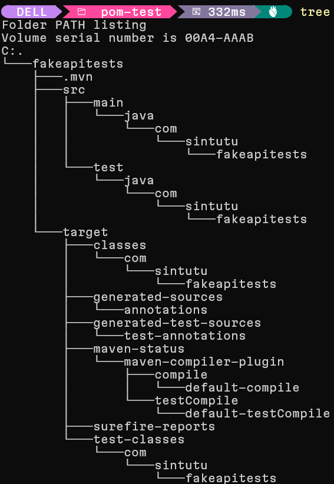

# Is there a `mvn` template for junit 5 and selenium?

I want to use the `mvn` cli to generate a template that contains at least junit. I ant to learn how to add selenium as a project dependency. At this point I don't know how to use `mvn`. I'm doing things the hard way without IntelliJ so I can see what's happening under the hood.

A great place to start reading the doc is the [Maven Users Centre
](https://maven.apache.org/users/index.html). It's a gentle intro that contains child pages:
* [Maven in 5 Minutes](https://maven.apache.org/guides/getting-started/maven-in-five-minutes.html)
* [Maven Getting Started Guide](https://maven.apache.org/guides/getting-started/index.html)

In getting-started, I learned `mvn` needs `java` from [Maven in 5 Minutes](https://maven.apache.org/guides/getting-started/maven-in-five-minutes.html)! A lot of the learnings in this document are from reading these sources.

## `mvn` cli intro

To get help, I can type

```bash
mvn --help
```

At the top of the help menu, I get the usage guidance.

> `mvn --help`
>
> `usage: mvn [options] [<goal(s)>] [<phase(s)>]`

I can find the whole list of options on the [Maven CLI Options Reference
](https://maven.apache.org/ref/3.9.9/maven-embedder/cli.html (Maven CLI Options Reference
)).

## Creating a project {#create-project}

```pwsh
mvn archetype:generate -DgroupId=com.mycompany.app -DartifactId=my-app -DarchetypeArtifactId=maven-archetype-quickstart -DarchetypeVersion=1.5 -DinteractiveMode=false
```

This command from Maven in 5 minutes runs the `archetype:generate` goal with the options passed in for `groupId`, `artifatId`, `archetypeArtifactId`, `archetypeVersion` and `interactiveMode` set. The options are set with the `-D` prefix.

*Sadly, the help menu said I pass in `[options]` before `[goal]` but in use it's the other way around. Documentation isn't always perfect.*

The docs go on to [explain what this does](https://maven.apache.org/guides/getting-started/maven-in-five-minutes.html#what-did-i-just-do):

> You executed the Maven goal archetype:generate, and passed in various parameters to that goal. The prefix archetype is the plugin that provides the goal. If you are familiar with Ant, you may conceive of this as similar to a task. This archetype:generate goal created a simple project based upon a maven-archetype-quickstart archetype. Suffice it to say for now that a plugin is a collection of goals with a general common purpose. For example the jboss-maven-plugin, whose purpose is "deal with various jboss items".

Here's how I understand it.

1. The goal is `generate`.
2. The definition of `generate` is specific to the plugin `archetype`. 
    1. The Archetype Plugin allows the user to create a Maven project from an existing template called an archetype.
    2. The plugin `archetype` plugin has documentation [here](https://maven.apache.org/archetype/maven-archetype-plugin/).
    3. I want to use the generate goal which is defined [here](https://maven.apache.org/archetype/maven-archetype-plugin/generate-mojo.html)
    4. `archetype` is part of [Maven Core](https://maven.apache.org/ref/3.9.9/maven-core/index.html#maven-core)'s tools and thus is included by default.
3. I used the [maven-archetype-quickstart](https://maven.apache.org/archetypes/maven-archetype-quickstart/) archetype by passing it in via `-DarchetypeArtifactId`
    1. I specify the version of `maven-archetype-quickstart` that I want with `archetypeVersion`. It seems [1.5](https://mvnrepository.com/artifact/org.apache.maven.archetypes/maven-archetype-quickstart/1.5) is the latest available one of this archetype, as per https://mvnrepository.com/artifact/org.apache.maven.archetypes/maven-archetype-quickstart.
4. `groupId` is something mandatory to all [POMs](https://maven.apache.org/guides/getting-started/index.html#how-do-i-make-my-first-maven-project).
    1. This element indicates the unique identifier of the organization or group that created the project. The groupId is one of the key identifiers of a project and is typically based on the fully qualified domain name of your organization. For example org.apache.maven.plugins is the designated groupId for all Maven plugins. For my project I want it to be `com.sintutu.fakeapitests`. Why so specific? This whole project's purpose is to house *tests* on the fake api.
    2. The full specification for a POM is available [here](https://maven.apache.org/ref/3.9.9/maven-model/maven.html#maven).
5. `artifactId` is another manatory field mandatory to all [POMs](https://maven.apache.org/guides/getting-started/index.html#how-do-i-make-my-first-maven-project). 
    1. This element indicates the unique base name of the primary artifact being generated by this project. The primary artifact for a project is typically a JAR file. Secondary artifacts like source bundles also use the artifactId as part of their final name. A typical artifact produced by Maven would have the form <artifactId>-<version>.<extension> (for example, myapp-1.0.jar). I'm choosing to name mine `fakeapitests` because the primary artifact I want to publish *is* tests.
6. `interactiveMode` is set to false. It's a concept associated with a settings.xml file.
    1. This line is in this example just to ensure that I don't use any settings that may be defined somewhere and I'm not aware of it for this example.
    2. There are [two locations](https://maven.apache.org/settings.html#quick-overview)here a settings.xml file may live: the Maven install: `${maven.home}/conf/settings.xml` or a user's install: `${user.home}/.m2/settings.xml`. I've just checked `${maven.home}/conf/settings.xml` and it's commented out.
7. `-D` needs to be prefixed to each of the options I'm setting. It's weird. This turns out to not work in practice. Instead it's better to just use `--define` instead, and use it as a separate word rather than a prefix.

### What should I be getting out of running the command?

I should get something similar to


and a pom.xml similar to 

```xml
<project xmlns="http://maven.apache.org/POM/4.0.0" xmlns:xsi="http://www.w3.org/2001/XMLSchema-instance"
  xsi:schemaLocation="http://maven.apache.org/POM/4.0.0 http://maven.apache.org/xsd/maven-4.0.0.xsd">
  <modelVersion>4.0.0</modelVersion>
 
  <groupId>com.mycompany.app</groupId>
  <artifactId>my-app</artifactId>
  <version>1.0-SNAPSHOT</version>
 
  <name>my-app</name>
  <!-- FIXME change it to the project's website -->
  <url>http://www.example.com</url>
 
  <properties>
    <project.build.sourceEncoding>UTF-8</project.build.sourceEncoding>
    <maven.compiler.release>17</maven.compiler.release>
  </properties>
 
  <dependencyManagement>
    <dependencies>
      <dependency>
        <groupId>org.junit</groupId>
        <artifactId>junit-bom</artifactId>
        <version>5.11.0</version>
        <type>pom</type>
        <scope>import</scope>
      </dependency>
    </dependencies>
  </dependencyManagement>
 
  <dependencies>
    <dependency>
      <groupId>org.junit.jupiter</groupId>
      <artifactId>junit-jupiter-api</artifactId>
      <scope>test</scope>
    </dependency>
    <!-- Optionally: parameterized tests support -->
    <dependency>
      <groupId>org.junit.jupiter</groupId>
      <artifactId>junit-jupiter-params</artifactId>
      <scope>test</scope>
    </dependency>
  </dependencies>
 
  <build>
    <pluginManagement><!-- lock down plugins versions to avoid using Maven defaults (may be moved to parent pom) -->
       ... lots of helpful plugins
    </pluginManagement>
  </build>
</project>
```

In my case I'd be running the below command from repo root

```pwsh
mvn archetype:generate -DgroupId=com.sintutu.fakeapitests -DartifactId=fakeapitests -DarchetypeArtifactId=maven-archetype-quickstart -DarchetypeVersion=1.5 -DinteractiveMode=false
```

which would mean I'd have a new directory called `fakeapitests` with child directories `src` and `test`, as well as a `pom.xml`.

With this command I'd be getting a few extra things in `pom.xml`.

Where do these extra elements come from? The [Super POM](https://maven.apache.org/ref/3.9.9/maven-model-builder/super-pom.html).
> All models implicitly inherit from a super-POM:

Some of these are the the bare minimum, as defined in [Minimum POM](https://maven.apache.org/guides/introduction/introduction-to-the-pom.html#minimal-pom (Minimum POM documentation)).
The minimum requirement for a POM are the following tags:

* `project` root
* `modelVersion` - should be set to 4.0.0
* `groupId` - the id of the project's group.
* `artifactId` - the id of the artifact (project)
* `version` - the version of the artifact under the specified group

Since `groupId` and `artifactId` are already described, I'm going into the extra fields now.

1. `project` is at the root of the project object model definition. Because it's a project object. The `project` tag can have attributes
    1. xmlns="http://maven.apache.org/POM/4.0.0" 
    2. xmlns:xsi="http://www.w3.org/2001/XMLSchema-instance"
    3. xsi:schemaLocation="http://maven.apache.org/POM/4.0.0 http://maven.apache.org/xsd/maven-4.0.0.xsd"
    
2. `modelVersion` indicates what version of the object model this POM is using. The version of the model itself changes very infrequently but it is mandatory in order to ensure stability of use if and when the Maven developers deem it necessary to change the model.
    1. The value this takes on seems to be `4.0.0` to correspond with the XML Schema Definition (XSD) for Maven's Project Object Model (POM) version 4.0.0.

3. `version` indicates the version of the artifact generated by the project. Maven goes a long way to help you with version management and you will often see the SNAPSHOT designator in a version, which indicates that a project is in a state of development.
    1. This starts out as 1.0-SNAPSHOT as per https://maven.apache.org/guides/getting-started/index.html#what-is-a-snapshot-version
    2. The SNAPSHOT value refers to the 'latest' code along a development branch, and provides no guarantee the code is stable or unchanging. Conversely, the code in a 'release' version (any version value without the suffix SNAPSHOT) is unchanging.
    3. In other words, a SNAPSHOT version is the 'development' version before the final 'release' version. The SNAPSHOT is "older" than its release.
    4. During the release process, a version of x.y-SNAPSHOT changes to x.y. The release process also increments the development version to x.(y+1)-SNAPSHOT. For example, version 1.0-SNAPSHOT is released as version 1.0, and the new development version is version 1.1-SNAPSHOT.

It turns out the command didn't work correctly. The `-D` prefix failed miserably. Instead, this command worked:

```bash
 mvn archetype:generate --define groupId=com.sintutu.fakeapitests --define artifactId=fakeapitests --define archetypeVersion=1.5 --define interactiveMode=false
 ```

 It produced output to the console
> ```log
>[INFO] Scanning for projects...
>[INFO] 
>[INFO] ------------------< org.apache.maven:standalone-pom >-------------------
>[INFO] Building Maven Stub Project (No POM) 1
>[INFO] --------------------------------[ pom ]---------------------------------
>[INFO] 
>[INFO] >>> archetype:3.2.1:generate (default-cli) > generate-sources @ standalone-pom >>>
>[INFO] 
>[INFO] <<< archetype:3.2.1:generate (default-cli) < generate-sources @ standalone-pom <<<
>[INFO] 
>[INFO] 
>[INFO] --- archetype:3.2.1:generate (default-cli) @ standalone-pom ---
>[INFO] Generating project in Batch mode
>[INFO] No archetype defined. Using maven-archetype-quickstart (org.apache.maven.archetypes:maven-archetype-quickstart:1.5)
>[INFO] ----------------------------------------------------------------------------
>[INFO] Using following parameters for creating project from Archetype: maven-archetype-quickstart:1.5
>[INFO] ----------------------------------------------------------------------------
>[INFO] Parameter: groupId, Value: com.sintutu.fakeapitests
>[INFO] Parameter: artifactId, Value: fakeapitests
>[INFO] Parameter: version, Value: 1.0-SNAPSHOT
>[INFO] Parameter: package, Value: com.sintutu.fakeapitests
>[INFO] Parameter: packageInPathFormat, Value: com/sintutu/fakeapitests
>[INFO] Parameter: junitVersion, Value: 5.11.0
>[INFO] Parameter: package, Value: com.sintutu.fakeapitests
>[INFO] Parameter: groupId, Value: com.sintutu.fakeapitests
>[INFO] Parameter: artifactId, Value: fakeapitests
>[INFO] Parameter: javaCompilerVersion, Value: 17
>[INFO] Parameter: version, Value: 1.0-SNAPSHOT
>[WARNING] Don't override file C:\Users\DELL\dev\pom-test\fakeapitests\src\main\java\com\sintutu\fakeapitests
>[WARNING] Don't override file C:\Users\DELL\dev\pom-test\fakeapitests\src\test\java\com\sintutu\fakeapitests
>[WARNING] CP Don't override file C:\Users\DELL\dev\pom-test\fakeapitests\.mvn
>[INFO] Project created from Archetype in dir: >C:\Users\DELL\dev\pom-test\fakeapitests
>[INFO] >------------------------------------------------------------------------
>[INFO] BUILD SUCCESS
>[INFO] ------------------------------------------------------------------------
>[INFO] Total time:  4.112 s
>[INFO] Finished at: 2024-09-18T19:29:29+02:00
>[INFO] ------------------------------------------------------------------------
>```
So what do these log say?
1. It saw there was no pom.xml in the directory. So it created one.
2. It automatically picked the maven-archetype-quickstart archetype. But it did need to know which version of the maven-archetype-quickstart to use, which was 1.5. So it used that one.
3. It used the groupId and artifactId that was passed in.
4. It created the root directory with the name passed in as artifactId
5. It created version 1.0-SNAPSHOT
6. It set the package name to the groupId 
7. It set a variable packageInPathFormat to be the groupId with `/` substituted in for `.`.
8. It automatically included junitVersion 5.11.0
9. It seemingly passed in package, groupId and artifactId values again. I suspect it's in the dependency for junit.
10. It chose javaCompilerVersion 17
11. It chose the same version.
12. It seems to have created files in the directories .\fakeapitests\src\main\java\com\sintutu\fakeapitests and .\fakeapitests\src\test\java\com\sintutu\fakeapitests
13. It seems to have built the project successfully.

Here's the output in an image:


and here is the tree


And you get fakeapitests/pom.xml which looks like 

```xml                                               
<?xml version="1.0" encoding="UTF-8"?>
<project xmlns="http://maven.apache.org/POM/4.0.0" xmlns:xsi="http://www.w3.org/2001/XMLSchema-instance"
  xsi:schemaLocation="http://maven.apache.org/POM/4.0.0 http://maven.apache.org/xsd/maven-4.0.0.xsd">
  <modelVersion>4.0.0</modelVersion>

  <groupId>com.sintutu.fakeapitests</groupId>
  <artifactId>fakeapitests</artifactId>
  <version>1.0-SNAPSHOT</version>

  <name>fakeapitests</name>
  <!-- FIXME change it to the project's website -->
  <url>http://www.example.com</url>

  <properties>
    <project.build.sourceEncoding>UTF-8</project.build.sourceEncoding>
    <maven.compiler.release>17</maven.compiler.release>
  </properties>

  <dependencyManagement>
    <dependencies>
      <dependency>
        <groupId>org.junit</groupId>
        <artifactId>junit-bom</artifactId>
        <version>5.11.0</version>
        <type>pom</type>
        <scope>import</scope>
      </dependency>
    </dependencies>
  </dependencyManagement>

  <dependencies>
    <dependency>
      <groupId>org.junit.jupiter</groupId>
      <artifactId>junit-jupiter-api</artifactId>
      <scope>test</scope>
    </dependency>
    <!-- Optionally: parameterized tests support -->
    <dependency>
      <groupId>org.junit.jupiter</groupId>
      <artifactId>junit-jupiter-params</artifactId>
      <scope>test</scope>
    </dependency>
  </dependencies>

  <build>
    <pluginManagement><!-- lock down plugins versions to avoid using Maven defaults (may be moved to parent pom) -->
      <plugins>
        <!-- clean lifecycle, see https://maven.apache.org/ref/current/maven-core/lifecycles.html#clean_Lifecycle -->
        <plugin>
          <artifactId>maven-clean-plugin</artifactId>
          <version>3.4.0</version>
        </plugin>
        <!-- default lifecycle, jar packaging: see https://maven.apache.org/ref/current/maven-core/default-bindings.html#Plugin_bindings_for_jar_packaging -->
        <plugin>
          <artifactId>maven-resources-plugin</artifactId>
          <version>3.3.1</version>
        </plugin>
        <plugin>
          <artifactId>maven-compiler-plugin</artifactId>
          <version>3.13.0</version>
        </plugin>
        <plugin>
          <artifactId>maven-surefire-plugin</artifactId>
          <version>3.3.0</version>
        </plugin>
        <plugin>
          <artifactId>maven-jar-plugin</artifactId>
          <version>3.4.2</version>
        </plugin>
        <plugin>
          <artifactId>maven-install-plugin</artifactId>
          <version>3.1.2</version>
        </plugin>
        <plugin>
          <artifactId>maven-deploy-plugin</artifactId>
          <version>3.1.2</version>
        </plugin>
        <!-- site lifecycle, see https://maven.apache.org/ref/current/maven-core/lifecycles.html#site_Lifecycle -->
        <plugin>
          <artifactId>maven-site-plugin</artifactId>
          <version>3.12.1</version>
        </plugin>
        <plugin>
          <artifactId>maven-project-info-reports-plugin</artifactId>
          <version>3.6.1</version>
        </plugin>
      </plugins>
    </pluginManagement>
  </build>
</project>
```

## Do the tests work?

To test this, go into the newly created fakeapitests directory that contains the pom.xml and run mvn test

```bash
cd fakeapitests
mvn test
```

You get output 

>```log
>[INFO] Scanning for projects...
>[INFO] 
>[INFO] ---------------< com.sintutu.fakeapitests:fakeapitests >----------------
>[INFO] Building fakeapitests 1.0-SNAPSHOT
>[INFO]   from pom.xml
>[INFO] --------------------------------[ jar ]---------------------------------
>[INFO] 
>[INFO] --- resources:3.3.1:resources (default-resources) @ fakeapitests ---
>[INFO] skip non existing resourceDirectory C:\Users\DELL\dev\pom-test\fakeapitests\src\main\resources
>[INFO] 
>[INFO] --- compiler:3.13.0:compile (default-compile) @ fakeapitests ---
>[INFO] Recompiling the module because of changed source code.
>[INFO] Compiling 1 source file with javac [debug release 17] to target\classes
>[INFO] 
>[INFO] --- resources:3.3.1:testResources (default-testResources) @ fakeapitests ---
>[INFO] skip non existing resourceDirectory C:\Users\DELL\dev\pom-test\fakeapitests\src\test\resources
>[INFO] 
>[INFO] --- compiler:3.13.0:testCompile (default-testCompile) @ fakeapitests ---
>[INFO] Recompiling the module because of changed dependency.
>[INFO] Compiling 1 source file with javac [debug release 17] to target\test-classes
>[INFO] 
>[INFO] --- surefire:3.3.0:test (default-test) @ fakeapitests ---
>[INFO] Using auto detected provider org.apache.maven.surefire.junitplatform.JUnitPlatformProvider
>[INFO] 
>[INFO] -------------------------------------------------------
>[INFO]  T E S T S
>[INFO] -------------------------------------------------------
>[INFO] Running com.sintutu.fakeapitests.AppTest
>[INFO] Tests run: 1, Failures: 0, Errors: 0, Skipped: 0, Time elapsed: 0.046 s -- in com.sintutu.fakeapitests.AppTest
>[INFO] 
>[INFO] Results:
>[INFO] 
>[INFO] Tests run: 1, Failures: 0, Errors: 0, Skipped: 0
>[INFO] 
>[INFO] ------------------------------------------------------------------------
>[INFO] BUILD SUCCESS
>[INFO] ------------------------------------------------------------------------
>[INFO] Total time:  2.373 s
>[INFO] Finished at: 2024-09-18T21:50:26+02:00
>[INFO] ------------------------------------------------------------------------
>```


Something about pom.xml made the output go through these tests. It's unclear exactly what at this stage.

## Lifecycles

`mvn test` is a phase in the [default life cycle](https://truware.co.za/charisma-healthcare/application-for-registration/introduction.asp).

[Introduction to the Build Lifecycle](https://maven.apache.org/guides/introduction/introduction-to-the-lifecycle.html) provides a nice explainer on lifecycles.

> ### Build Lifecycle Basics
>Maven is based around the central concept of a build lifecycle. What this means is that the process for building and distributing a particular artifact (project) is clearly defined.
>
>For the person building a project, this means that it is only necessary to learn a small set of commands to build any Maven project, and the POM will ensure they get the results they desired.
>
>There are three built-in build lifecycles: `default`, `clean` and `site`. The `default` lifecycle handles your project deployment, the `clean` lifecycle handles project cleaning, while the `site` lifecycle handles the creation of your project's web site.
>
>### A Build Lifecycle is Made Up of Phases
>Each of these build lifecycles is defined by a different list of build phases, wherein a build phase represents a stage in the lifecycle.
>
>For example, the default lifecycle comprises of the following phases (for a complete list of the lifecycle phases, refer to the [Lifecycle Reference](https://maven.apache.org/guides/introduction/introduction-to-the-lifecycle.html#lifecycle-reference)):
>
> * `validate` - validate the project is correct and all necessary information is available
> * `compile` - compile the source code of the project
> * `test` - test the compiled source code using a suitable unit testing framework. These tests should not require the code be packaged or deployed
> * `package` - take the compiled code and package it in its distributable format, such as a JAR.
> * `verify` - run any checks on results of integration tests to ensure quality criteria are met
> * `install` - install the package into the local repository, for use as a dependency in other projects locally
> * `deploy` - done in the build environment, copies the final package to the remote repository for sharing with other developers and projects.
>
>These lifecycle phases (plus the other lifecycle phases not shown here) are executed sequentially to complete the default lifecycle. Given the lifecycle phases above, this means that when the default lifecycle is used, Maven will first validate the project, then will try to compile the sources, run those against the tests, package the binaries (e.g. jar), run integration tests against that package, verify the integration tests, install the verified package to the local repository, then deploy the installed package to a remote repository.

At this point something pops up: `mvn test` only runs unit tests! If I want to run integration tests I may need to do more setup.

Introduction to the Build Lifecycle continues:

> ### Usual Command Line Calls
>You should select the phase that matches your outcome. If you want your jar, run package. If you want to run the unit tests, run test.
>
>If you are uncertain what you want, the preferred phase to call is
> ```bash
> mvn verify
>```
>This command executes each default lifecycle phase in order (validate, compile, package, etc.), before executing verify. You only need to call the last build phase to be executed, in this case, verify. In most cases the effect is the same as package. However, in case there are integration-tests, these will be executed as well. And during the verify phase some additional checks can be done, e.g. if your code written according to the predefined checkstyle rules.
>
>In a build environment, use the following call to cleanly build and deploy artifacts into the shared repository.
>```bash
> mvn clean deploy
>```
>The same command can be used in a multi-module scenario (i.e. a project with one or more subprojects). Maven traverses into every subproject and executes clean, then executes deploy (including all of the prior build phase steps).

It seems I'll need to run integration tests with `validate` to ensure integration tests run. But a quick glance [Default Lifecycle](https://maven.apache.org/guides/introduction/introduction-to-the-lifecycle.html#default-lifecycle) in the same Introduction to the Build Lifecycle article shows preceding phases of the lifecycle to `validate` that are of interest to integration testing:

> * `generate-test-sources` -	generate any test source code for inclusion in compilation.
> * `process-test-sources` -	process the test source code, for example to filter any values.
> * `generate-test-resources` -	create resources for testing.
process-test-resources	copy and process the resources into the test destination directory.
> * `test-compile` -	compile the test source code into the test destination directory
> * `process-test-classes` -	post-process the generated files from test compilation, for example to do bytecode enhancement on Java classes.

These above phases before the `test` phase. The below phases come after the `test` phase but before the `validate` phase.

> * `prepare-package` -	perform any operations necessary to prepare a package before the actual packaging. This often results in an unpacked, processed version of the package.
> * `package` -	take the compiled code and package it in its distributable format, such as a JAR.
> * `pre-integration-test` -	perform actions required before integration tests are executed. This may involve things such as setting up the required environment.
> * `integration-test` -	process and deploy the package if necessary into an environment where integration tests can be run.
> * `post-integration-test` -	perform actions required after integration tests have been executed. This may including cleaning up the environment.

When focusing on my integration tests on FakeRestApi I'll likely want the ability to package and deploy my tests on an integration environment. That may be useful. But I'm not yet at a stage where I've set up an integration environment to deploy to. It may be sufficient to use the `test` phase while using Selenium on my local environment.

Further down Introduction to the Build Lifecycle it continues with:

> ### How do I compile my test sources and run my unit tests?
>Now you're successfully compiling your application's sources and now you've got some unit tests that you want to compile and execute (because every programmer always writes and executes their unit tests *nudge nudge wink wink*).
>
>Execute the following command:
>```bash
> mvn test
>```
>Upon executing this command you should see output like the following:
>
>```log
>[INFO] Scanning for projects...
>[INFO]
>[INFO] ----------------------< com.mycompany.app:my-app >----------------------
>[INFO] Building my-app 1.0-SNAPSHOT
>[INFO] --------------------------------[ jar ]---------------------------------
>[INFO]
>[INFO] --- maven-resources-plugin:3.0.2:resources (default-resources) @ my-app ---
>[INFO] Using 'UTF-8' encoding to copy filtered resources.
>[INFO] skip non existing resourceDirectory <dir>/my-app/src/main/resources
>[INFO]
>[INFO] --- maven-compiler-plugin:3.8.0:compile (default-compile) @ my-app ---
>[INFO] Nothing to compile - all classes are up to date
>[INFO]
>[INFO] --- maven-resources-plugin:3.0.2:testResources (default-testResources) @ my-app ---
>[INFO] Using 'UTF-8' encoding to copy filtered resources.
>[INFO] skip non existing resourceDirectory <dir>/my-app/src/test/resources
>[INFO]
>[INFO] --- maven-compiler-plugin:3.8.0:testCompile (default-testCompile) @ my-app ---
>[INFO] Changes detected - recompiling the module!
>[INFO] Compiling 1 source file to <dir>/my-app/target/test-classes
>[INFO]
>[INFO] --- maven-surefire-plugin:2.22.1:test (default-test) @ my-app ---
>[INFO]
>[INFO] -------------------------------------------------------
>[INFO]  T E S T S
>[INFO] -------------------------------------------------------
>[INFO] Running com.mycompany.app.AppTest
>[INFO] Tests run: 1, Failures: 0, Errors: 0, Skipped: 0, Time elapsed: 0.025 s - in com.mycompany.app.AppTest
>[INFO]
>[INFO] Results:
>[INFO]
>[INFO] Tests run: 1, Failures: 0, Errors: 0, Skipped: 0
>[INFO]
>[INFO] ------------------------------------------------------------------------
>[INFO] BUILD SUCCESS
>[INFO] ------------------------------------------------------------------------
>[INFO] Total time:  1.881 s
>[INFO] Finished at: 2020-07-12T12:00:33+01:00
>[INFO] ------------------------------------------------------------------------
>```
>Some things to notice about the output:
>
>Maven downloads more dependencies this time. These are the dependencies and plugins necessary for executing the tests (it already has the dependencies it needs for compiling and won't download them again).
>Before compiling and executing the tests Maven compiles the main code (all these classes are up to date because we haven't changed anything since we compiled last).
>If you simply want to compile your test sources (but not execute the tests), you can execute the following:
>```bash
> mvn test-compile
>```

With the working assumption being that I'd be using the unit test runner to run Selenium tests on local, `mvn test` and `mvn test-compile` seem like useful things to know. I'd just have to remove the directory `faketestapi/src/main` and all the child directories in there.

> ### A Build Phase is Made Up of Plugin Goals
>However, even though a build phase is responsible for a specific step in the build lifecycle, the manner in which it carries out those responsibilities may vary. And this is done by declaring the plugin goals bound to those build phases.
>
>A plugin goal represents a specific task (finer than a build phase) which contributes to the building and managing of a project. It may be bound to zero or more build phases. A goal not bound to any build phase could be executed outside of the build lifecycle by direct invocation. The order of execution depends on the order in which the goal(s) and the build phase(s) are invoked. For example, consider the command below. The clean and package arguments are build phases, while the dependency:copy-dependencies is a goal (of a plugin).
>```bash
>mvn clean dependency:copy-dependencies package
>```
>If this were to be executed, the clean phase will be executed first (meaning it will run all preceding phases of the clean lifecycle, plus the clean phase itself), and then the dependency:copy-dependencies goal, before finally executing the package phase (and all its preceding build phases of the default lifecycle).
>
>Moreover, if a goal is bound to one or more build phases, that goal will be called in all those phases.
>
>Furthermore, a build phase can also have zero or more goals bound to it. If a build phase has no goals bound to it, that build phase will not execute. But if it has one or more goals bound to it, it will execute all those goals.
>
>(Note: In Maven 2.0.5 and above, multiple goals bound to a phase are executed in the same order as they are declared in the POM, however multiple instances of the same plugin are not supported. Multiple instances of the same plugin are grouped to execute together and ordered in Maven 2.0.11 and above).

What this section says is that I can fine-tune what's going on.

1. I first run the `clean` [lifecycle](https://maven.apache.org/guides/introduction/introduction-to-the-lifecycle.html#clean-lifecycle) which does the phases `pre-clean`, `clean` and `post-clean`. Recall that the `clean` phase implicitly calls in the `~/.m2/repository/org/apache/maven/plugins/maven-clean-plugin/3.4.0/maven-clean-plugin-3.4.0.jar` plugin and does implicit goals for the phases.
2. I then call the dependency plugin (it's the one sitting in `~/.m2/repository/org/apache/maven/plugins/maven-dependency-plugin/3.7.0/maven-dependency-plugin-3.7.0.jar`) and ask it to do the `copy-dependencies` goal. While phases do tasks, here I'm asking for a goal to prompt the task be done.
3. I then go use the default lifecycle's `package` phase. `package` is bound to the plugin `~/.m2/repository/org/apache/maven/plugins/maven-jar-plugin/3.4.2/maven-jar-plugin-3.4.2.jar` plugin and executes the goal `jar`.

This idea of calling a phase in some lifecycle and having it implictly call plugins is because of some clever default mappings. e.g. [package uses plugin bindings for packages](https://maven.apache.org/ref/3.9.9/maven-core/default-bindings.html#plugin-bindings-for-jar-packaging)
>```xml
><phases>
>  <process-resources>
>    org.apache.maven.plugins:maven-resources-plugin:3.3.1:resources
>  </process-resources>
>  <compile>
>    org.apache.maven.plugins:maven-compiler-plugin:3.13.0:compile
>  </compile>
>  <process-test-resources>
>    org.apache.maven.plugins:maven-resources-plugin:3.3.1:testResources
>  </process-test-resources>
>  <test-compile>
>    org.apache.maven.plugins:maven-compiler-plugin:3.13.0:testCompile
>  </test-compile>
>  <test>
>    org.apache.maven.plugins:maven-surefire-plugin:3.2.5:test
>  </test>
>  <package>
>    org.apache.maven.plugins:maven-jar-plugin:3.4.1:jar
>  </package>
>  <install>
>    org.apache.maven.plugins:maven-install-plugin:3.1.2:install
>  </install>
>  <deploy>
>    org.apache.maven.plugins:maven-deploy-plugin:3.1.2:deploy
>  </deploy>
></phases>
>```

Learnings here are that a phase has a binding to a plugin and a standard goal to achieve. Sometimes there is no phase appropriate for what you want to achieve, in which case you can call the plugin and the goal directly.

Introduction to the Build Lifecycle it continues with:

> ### Plugins
>The second way to add goals to phases is to configure plugins in your project. Plugins are artifacts that provide goals to Maven. Furthermore, a plugin may have one or more goals wherein each goal represents a capability of that plugin. For example, the Compiler plugin has two goals: `compile` and `testCompile`. The former compiles the source code of your main code, while the latter compiles the source code of your test code.
>
>As you will see in the later sections, plugins can contain information that indicates which lifecycle phase to bind a goal to. Note that adding the plugin on its own is not enough information - you must also specify the goals you want to run as part of your build.
>
>The goals that are configured will be added to the goals already bound to the lifecycle from the packaging selected. If more than one goal is bound to a particular phase, the order used is that those from the packaging are executed first, followed by those configured in the POM. Note that you can use the `<executions>` element to gain more control over the order of particular goals.
>
>For example, the Modello plugin binds by default its goal `modello:java` to the `generate-sources` phase (Note: The `modello:java` goal generates Java source codes). So to use the Modello plugin and have it generate sources from a model and incorporate that into the build, you would add the following to your POM in the `<plugins>` section of `<build>`:
>```xml
> <plugin>
>   <groupId>org.codehaus.modello</groupId>
>   <artifactId>modello-maven-plugin</artifactId>
>   <version>1.8.1</version>
>   <executions>
>     <execution>
>       <configuration>
>         <models>
>           <model>src/main/mdo/maven.mdo</model>
>         </models>
>         <version>4.0.0</version>
>       </configuration>
>       <goals>
>         <goal>java</goal>
>       </goals>
>     </execution>
>   </executions>
> </plugin>
>```
>
>You might be wondering why that `<executions>` element is there. That is so that you can run the same goal multiple times with different configuration if needed. Separate executions can also be given an ID so that during inheritance or the application of profiles you can control whether goal configuration is merged or turned into an additional execution.
>
>When multiple executions are given that match a particular phase, they are executed in the order specified in the POM, with inherited executions running first.
>
>Now, in the case of `modello:java`, it only makes sense in the `generate-sources` phase. But some goals can be used in more than one phase, and there may not be a sensible default. For those, you can specify the phase yourself. For example, let's say you have a goal `display:time` that echos the current time to the commandline, and you want it to run in the `process-test-resources` phase to indicate when the tests were started. This would be configured like so:
>```xml
> <plugin>
>   <groupId>com.mycompany.example</groupId>
>   <artifactId>display-maven-plugin</artifactId>
>   <version>1.0</version>
>   <executions>
>     <execution>
>       <phase>process-test-resources</phase>
>       <goals>
>         <goal>time</goal>
>       </goals>
>     </execution>
>   </executions>
> </plugin>
>```

I'm focusing here on the `process-test-resources` phase. It's one of those phases that would get run before `verify` so it doesn't get much attention. What's interesting here is that it typically has the goal `testResources`. Here the goal `time` is added in that same phase.

## POM Basics

This comes straight out of Maven Getting Started Guide's "[How do I make my first Maven project?](https://maven.apache.org/guides/getting-started/index.html#how-do-i-make-my-first-maven-project)" This is the same guide I used earlier in the [Create a Project](#creating-a-project-create-project) section.

>`pom.xml` contains the Project Object Model (POM) for this project. The POM is the basic unit of work in Maven. This is important to remember because Maven is inherently project-centric in that everything revolves around the notion of a project. In short, the POM contains every important piece of information about your project and is essentially one-stop-shopping for finding anything related to your project. Understanding the POM is important and new users are encouraged to refer to the Introduction to the POM.
>
>This is a very simple POM but still displays the key elements every POM contains, so let's walk through each of them to familiarize you with the POM essentials:
>
>* `project` - This is the top-level element in all Maven pom.xml files.
>* `modelVersion` - This element indicates what version of the object model this POM is using. The version of the model itself changes very infrequently but it is mandatory in order to ensure stability of use if and when the Maven developers deem it necessary to change the model.
>*  `groupId` - This element indicates the unique identifier of the organization or group that created the project. The groupId is one of the key identifiers of a project and is typically based on the fully qualified domain name of your organization. For example org.apache.maven.plugins is the designated groupId for all Maven plugins.
>* `artifactId` - This element indicates the unique base name of the primary artifact being generated by this project. The primary artifact for a project is typically a JAR file. Secondary artifacts like source bundles also use the artifactId as part of their final name. A typical artifact produced by Maven would have the form <artifactId>-<version>.<extension> (for example, myapp-1.0.jar).
>* `version` - This element indicates the version of the artifact generated by the project. Maven goes a long way to help you with version management and you will often see the SNAPSHOT designator in a version, which indicates that a project is in a state of development. We will discuss the use of snapshots and how they work further on in this guide.
>* `name` - This element indicates the display name used for the project. This is often used in Maven's generated documentation.
>* `url` - This element indicates where the project's site can be found. This is often used in Maven's generated documentation.
>* `properties` - This element contains value placeholders accessible anywhere within a POM.
>* `dependencies` - This element's children list dependencies. The cornerstone of the POM.
>* `build` - This element handles things like declaring your project's directory structure and managing plugins.

It's useful to revisit this section having gone through the lifecycle. Lifecycle is heavily influenced by the POM.

### `build`

Maven does a lot of things though it seems to be boiled down to handling the build process. 

The output from creating the first project is repeated again here, focusing in the `build` tag.

>```xml
> <build>
>    <pluginManagement><!-- lock down plugins versions to avoid using Maven defaults (may be moved to parent pom) -->
>      <plugins>
>        <!-- clean lifecycle, see https://maven.apache.org/ref/current/maven-core/lifecycles.html#clean_Lifecycle -->
>        <plugin>
>          <artifactId>maven-clean-plugin</artifactId>
>          <version>3.4.0</version>
>        </plugin>
>        <!-- default lifecycle, jar packaging: see https://maven.apache.org/ref/current/maven-core/default-bindings.html#Plugin_bindings_for_jar_packaging -->
>        <plugin>
>          <artifactId>maven-resources-plugin</artifactId>
>          <version>3.3.1</version>
>        </plugin>
>        <plugin>
>          <artifactId>maven-compiler-plugin</artifactId>
>          <version>3.13.0</version>
>        </plugin>
>        <plugin>
>          <artifactId>maven-surefire-plugin</artifactId>
>          <version>3.3.0</version>
>        </plugin>
>        <plugin>
>          <artifactId>maven-jar-plugin</artifactId>
>          <version>3.4.2</version>
>        </plugin>
>        <plugin>
>          <artifactId>maven-install-plugin</artifactId>
>          <version>3.1.2</version>
>        </plugin>
>        <plugin>
>          <artifactId>maven-deploy-plugin</artifactId>
>          <version>3.1.2</version>
>        </plugin>
>        <!-- site lifecycle, see https://maven.apache.org/ref/current/maven-core/lifecycles.html#site_Lifecycle -->
>        <plugin>
>          <artifactId>maven-site-plugin</artifactId>
>          <version>3.12.1</version>
>        </plugin>
>        <plugin>
>          <artifactId>maven-project-info-reports-plugin</artifactId>
>          <version>3.6.1</version>
>        </plugin>
>      </plugins>
>    </pluginManagement>
>  </build>
>```

This `build` tag seems to contain only the `pluginManagement` tag. `pluginManagement` seems to contain only `plugin` elements. Each `plugin` element specifies an `artifactId` and a `version`. Many of these `artifactId` values seem to reference things in the local repository at  `~/.m2/repository/org/apache/maven/plugins`. I believe the lifecycle resolves from the plugins defined in `build` to do the tasks that achieve the goals in each phase of the lifecycle.

### `dependencyManagement` and `dependencies`

The output from creating the first project is repeated again here, focusing in the `dependencyManagement` and `dependencies` tags. 

>```xml
> <dependencyManagement>
>    <dependencies>
>      <dependency>
>        <groupId>org.junit</groupId>
>        <artifactId>junit-bom</artifactId>
>        <version>5.11.0</version>
>        <type>pom</type>
>        <scope>import</scope>
>      </dependency>
>    </dependencies>
>  </dependencyManagement>
>
>  <dependencies>
>    <dependency>
>      <groupId>org.junit.jupiter</groupId>
>      <artifactId>junit-jupiter-api</artifactId>
>      <scope>test</scope>
>    </dependency>
>    <!-- Optionally: parameterized tests support -->
>    <dependency>
>      <groupId>org.junit.jupiter</groupId>
>      <artifactId>junit-jupiter-params</artifactId>
>      <scope>test</scope>
>    </dependency>
>  </dependencies>
>```

So what's going on here?

Looking at `${dependencies.dependency.scope}` the value is `test`. What that seems to imply is that in the default lifecycle this dependency is only relevant for the `test` phase. This is for both the artifacts `junit-jupiter-api` and `junit-jupiter-params` that are in the group with Id `org.junit.jupiter`. I'm suspecting that `dependencies` allows you to fine-tune your dependency to the particular phase in a lifecycle where it's relevant.

Also noticing that there's no version information specified. That appears in `${dependencyManagement.dependencies.dependency.version}` and it's set to 5.11.0 for artifact with id `junit-bom` and group with id `org.junit`. 

It seems that the version information is passed through `dependencyManagement` to anything with `groupId` like `org.junit.*` which is how different artifacts `junit-jupiter-api` and `junit-jupiter-params` get the same version number. In fact, the artifacts are likely packaged within `junit-bom`. Apparently `junit-bom` is the [bill of materials](https://mvnrepository.com/artifact/org.junit/junit-bom (This Bill of Materials POM can be used to ease dependency management when referencing multiple JUnit artifacts using Gradle or Maven.
)) needed to run JUnit5.

### `name`, `url` and `properties`

>```xml
>  <name>fakeapitests</name>
>  <!-- FIXME change it to the project's website -->
>  <url>http://www.example.com</url>
>
>  <properties>
>    <project.build.sourceEncoding>UTF-8</project.build.sourceEncoding>
>    <maven.compiler.release>17</maven.compiler.release>
>  </properties>
>```

This first project is just named `fakeapitests` with example.com as the `url`. These are things probably fixable later once I know what I want. `properties` is cool because it allows me to define variables that I'd want to use elsewhere in the pom.xml. This particular pom.xml doesn't reference any of these properties but it's nice to see it's there.

And that brings to a pause all that can be gleaned from exploring an example pom generated with the command 

```bash
 mvn archetype:generate --define groupId=com.sintutu.fakeapitests --define artifactId=fakeapitests --define archetypeVersion=1.5 --define interactiveMode=false
 ```