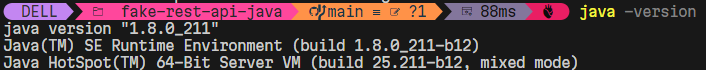
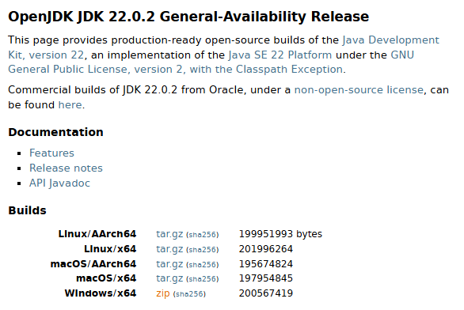
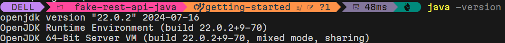

# Installing OpenJDK

## Why install OpenJDK 22?
1. It's open source. I'm choosing open source because it's likelier to be portable. I've seen it being pre-installed in some community projects somewhere.
2. The newer version is likelier to have some capabilities that past developers are already taking advantage of. It's just better for me to know the up-to-date java concepts than to use the old-school ways.

The biggest reason I want to do it is because it's likely hard. I'm used to using a .msi installer which puts the binaries in place and handles the PATH or the JAVA_HOME environment variables. I want to do this the hard way so I understand how to call `java` and `mvn` wherever I am. And since I'm interested in portability I want to know how to eventually install these in a docker image or using a shell script using (`pwsh` or `bash`) on some environment I don't even own. 

Currently I already have java installed on my machine.

.

I went to https://dev.java for official documentation. [Getting Started with Java](https://dev.java/learn/getting-started/#setting-up-jdk(Getting Started with Java: setting up jdk)) seems like a good idea.

What I've noticed is intriguing. To install Java you go to https://jdk.java.net/. You get met with Java 22. This isn't a LTS but a general availability release. Why promote this one and not an LTS? Security vulnerabilities. It's not recommennded to use Java 21 in production because of these vulnerabilities. I'm sticking to the LTS just because I'm expecting the same advantage of widespread adoption of an LTS and waryness of security vulnerabilities. I'll learn about the security vulnerabilities later. I'll suffer not using an LTS later. I really would have preferred aln LTS.

Also intriguing was that the latest LTS wasn't java 17. I'm out of date on a lot of things. Of the many LTS releases out there I really can't say which one is the best to learn from. Did Java 17 get widely adopted? Are people still using java 8? No idea.

I'm installing this from https://jdk.java.net/22/

>OpenJDK JDK 22.0.2 General-Availability Release
>This page provides production-ready open-source builds of the Java Development Kit, version 22, an implementation of the Java SE 22 Platform under the GNU General Public License, version 2, with the Classpath Exception.e



What I did was download [openjdk-22.0.2_windows-x64_bin.zip](https://download.java.net/java/GA/jdk22.0.2/c9ecb94cd31b495da20a27d4581645e8/9/GPL/openjdk-22.0.2_windows-x64_bin.zip). I extracted the zip to find the folder `jdk-22.0.2`. I moved the folder into `C:\Program Files\Java` then I updated the system variables `$env:PATH` for the existing `C:\Program Files\Java\jdk-1.8.0_211\bin` to `C:\Program Files\Java\jdk-22.0.2\bin`. Then I restarted my computer. Only after that did I get the java version I wanted when I ran `java -version`.

.

### Hello World

To make a hello world:

Create a directory hello-world

```bash
mkdir hello-world
```
and create an empty file called HelloWorld.java inside hello-world with the `>` operator and `cd`

```bash
cd .\hello-world\ 
cd . > HelloWorld.java
```

The content of `HelloWorld.java` is
```java
public class HelloWorld 
{
    public static void main(String... args) 
    {
        System.out.println("Hello, World!");
    }
}
```
>notice the non-traditional `String...` instead of `String[]`. Might be some Java update I've never heard of.

Compile the `.java` file with 

```bash
javac HelloWorld.java
```

Run the HelloWorld class

```bash
java HelloWorld
```

or 

```bash
java HelloWorld.java
```

Now that it's proven Java works this hello-world can be deleted.