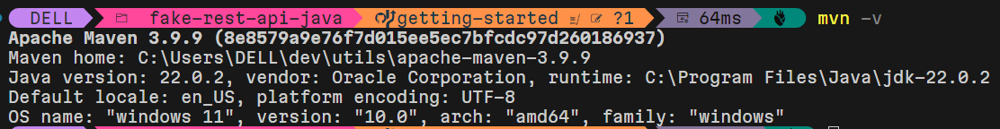

# Intro to Maven

I was looking for a java equivalent to the dotnet cli. It turns out it's [maven](https://maven.apache.org/what-is-maven.html (What is Maven?)). From what I see I can use it like I use the dotnet cli. That is to say:
1. Create my solution
2. Create my projects
3. Add my projects to my solution
4. Build my solution or
5. Build individual projects
6. Test my solution
7. Pack my artifacts
8. Publish my artifacts
9. Consume my artifacts

What's different is the paradigm between what I use dotnet cli for and what I can use mvn cli for.

## mvn paradigm shift

The below musings come from looking at the [User guide](https://maven.apache.org/users/index.html).

### Java must be installed

I must install Java to proceed. I show how to do that in [Installing OpenJDK](installing-openjdk.md).

### Install Maven

Now I've got two options on installing maven: from binary or from source. If I download from source then I have to [build maven myself](https://maven.apache.org/download.cgi). I don't want to do that. I want something ready made. So I follow the [installation instructions](https://maven.apache.org/install.html (Installation instructions)) by unzipping the downloaded [apache-maven-3.99.zip](https://dlcdn.apache.org/maven/maven-3/3.9.9/binaries/apache-maven-3.9.9-bin.zip) and putting it into my utils folder C:\Users\DELL\dev\utils\apache-maven-3.9.9\bin and adding this into my `PATH`.

